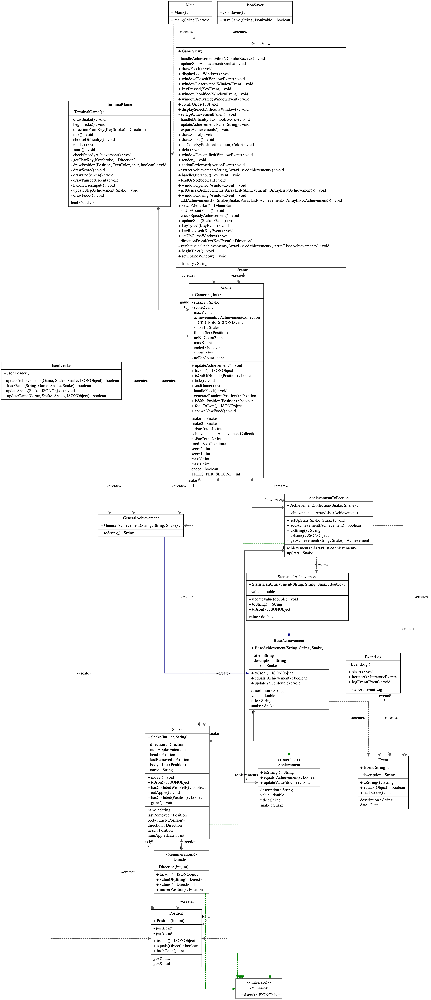

# My Personal Project

## Description

The project I want to develop is a Snake game. The game will be a single player game where the player controls a snake
that grows in length as it eats food (apple). The snake will move at a constant speed and the player will be able to
control the direction of the snake. The game will end when the snake collides with itself or the wall.  

The user can choose the difficulty of the game. The difficulty will be determined by the speed of the snake. The user
can also pause and save the game and resume it later.  

During the game, the achievements of the player will be recorded and displayed at the end of the game. The achievements
are a number of special events that the player can achieve during the game. For example, the player can achieve a "The
Chosen One" achievement if the snake eats 10 apples in a row without colliding with itself or the wall. The statistics
of the game will also be displayed at the end of the game. The statistics include the score, the number of keystrokes,
the play time, and the number of achievements the player has achieved.

## User Stories

- As a player, I want to be able to control the direction of the snake.
- As a player, I want to be able to choose the difficulty of the game.
- As a player, I want to be able to see the score and play time as I play the game.
- As a player, I want my achievements and actions during the game to be recorded and displayed at the end of the game.
- As a player, I want to play a double player game with my friend.
- As a player, I want to be able to pause and save the game during the game play and resume it later.
- As a player, I want to have the option to load a saved game and continue playing it.

## List of Achievements
- Events
  1. The Chosen One: The apple attempts to spawn inside a snake's body. 
  2. The Survivor: Survive for 1000 rounds without eating any apples or colliding. 
  3. The Eater: Eat 100 apples in total.
  4. The Speedy: Finish the game in less than 20 rounds.
- Statistical
  1. The keystrokes: The number of keystrokes the player has made.
  2. Steps in each direction: The number of steps the player has made in each direction.
  3. Total rounds: The total number of rounds the player has played.
  4. Eaten apples: The number of apples the player has eaten.
## Instructions for Grader 
- You can add get an achievement added to the game by finishing the game in less than 20 rounds.
- You can filter the achievements by clicking the "Filter" button and selecting the type of achievements you want to see.
- You can export the achievements to a file by clicking the "Export Achievements" button at the end of the game to share
  with your friends.
- You can locate my visual component at the last about page of the game.
- You can save the game by clicking the "File" -> "Save" menu item.
- You will be prompted to load a saved game when you start the game. 

## Phase 4: Task 2
```text
Game ended. Logging events...
Tue Nov 28 18:13:25 PST 2023
Initialized statistical achievements for one
Tue Nov 28 18:13:25 PST 2023
Initialized statistical achievements for two
Tue Nov 28 18:13:27 PST 2023
...
Tue Nov 28 18:13:32 PST 2023
Updated achievement Step Leftwards from one by 1.0
Tue Nov 28 18:13:32 PST 2023
Updated achievement Step Leftwards from two by 1.0
Tue Nov 28 18:13:32 PST 2023
Game ended
```
## Phase 4: Task 3
-   
One design improvement I can think of is to adopt the *MVC design pattern*. Currently, I have the view and the model but without a controller. Therefore, the logic that handles the user input and responds to it are all in the `GameView` class. This can be identified by seeing that the `GameView` class implements all `ActionListener`, `KeyListener`, and `WindowListener` and has the `JFrame` object that shows the game window. This reduces the cohesion of the `GameView` class and makes it harder to maintain. 

Therefore, I can create a controller class that handles the user input and responds to it. This will separate the responsibilities of displaying the game window and handling the user input to two different classes. The ideal MVC design of the game will consist of a model class that represents the game state, a view class that displays the game window and draw visual components, and a controller class that handles the user input and updates the game state and the view accordingly.

## Citations 
1. [SnakeConsole-Lanterna](https://github.students.cs.ubc.ca/CPSC210/SnakeConsole-Lanterna)
2. [JsonSerialization](https://github.students.cs.ubc.ca/CPSC210/JsonSerializationDemo)
3. [EventLog](https://github.students.cs.ubc.ca/CPSC210/AlarmSystem)